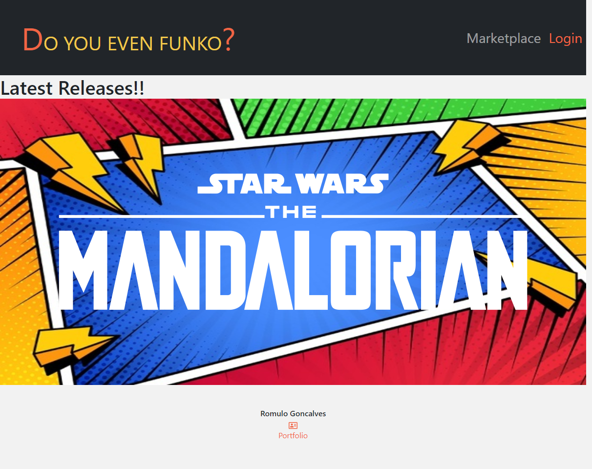

# Do You Even Funko?

    
    

## Table of Contents
    
[Description](#description)
[Installation](#installation-instructions)
[Usage Info](#usage-info)
[contribution](#contribution)
[Testing Instructions](#test-instructions)
[License](#license)
[Questions](#questions)
    

## Description
    An application directed to the funko community. It aims to help them manage their collection,
    post items to sell on the marketplace and interact using the forum. Some functionalities 
    are still being implemented but it will be up very soon.

## Installation Instructions
    Not installation necessary.

## Usage info
    Created you account, go to your dashboard and start enjoying it..

## Contribution
    contribution welcome upon request.

## Test Instructions
    undefined.    

## License
    This project is covered under MIT license.

## Questions
    For questions please refer to 
      
    or
    romulojusto@gmail.com
    
